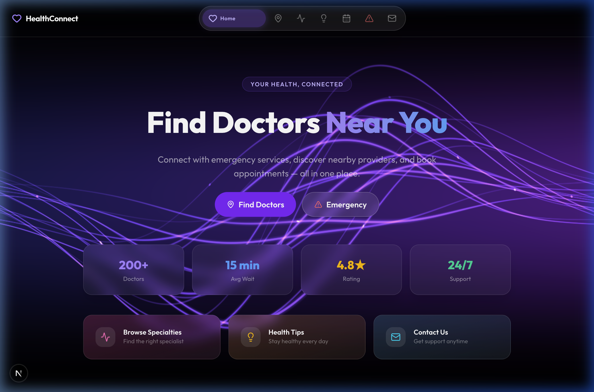
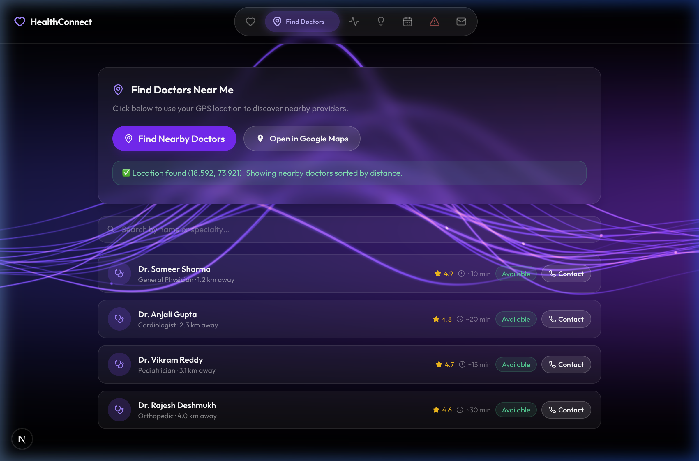
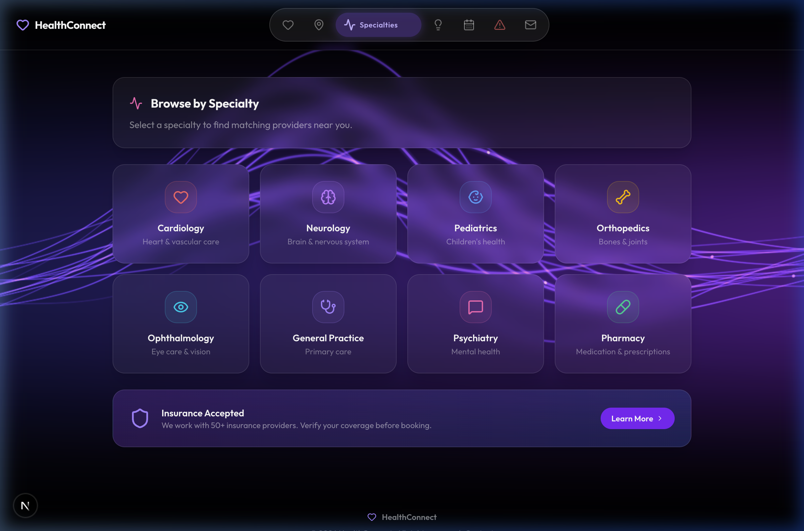
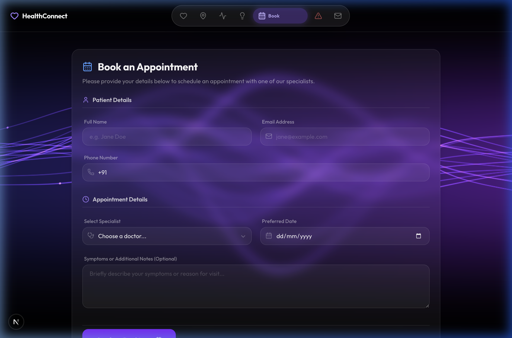

# 🏥 HealthConnect | Premium Healthcare Discovery

[](https://nextjs.org/)
[](https://supabase.com/)
[](https://tailwindcss.com/)
[](https://resend.com/)

**HealthConnect** is a state-of-the-art, full-stack healthcare platform designed to bridge the gap between patients and specialized medical care. Built with a "Mobile-First" philosophy and localized specifically for the **Indian market**, it offers a premium user experience combined with robust backend automation.

---

## ✨ Key Highlights

- **🇮🇳 Localized for India**: Pre-configured for Indian users with +91 phone formatting, local emergency numbers (108/102), and top-tier Indian medical institutions (AIIMS, Apollo, Max).
- **🎨 Elite Aesthetics**: Powered by the **Outfit** geometric font, featuring a sophisticated dark-mode glassmorphism UI with liquid-smooth animations.
- **📍 Smart Discovery**: Integrated Geolocation API to instantly detect user location and sort the nearest available specialists.
- **📧 Automated Notifications**: Built-in integration with **Resend** for professionally branded HTML appointment confirmation emails.
- **⚡ High Performance**: Utilizing **Next.js 15 (Turbopack)** for instantaneous page transitions and server-side safety.

---

## 📸 Visual Tour

### 1. The Command Center (Dashboard)
A visually stunning hero section designed to build trust and provide instant access to emergency and search services.


### 2. Intelligent Search & Discovery
Localized doctor listings featuring specialized medical profiles, real-time distance calculation, and availability status.


### 3. Specialization Hub
A curated explorer for medical specialties, using curated color palettes and smooth hover interactions.


### 4. Zero-Friction Booking
A streamlined, validation-ready appointment form that syncs directly with the Supabase PostgreSQL database.


---

## 🛠️ The Technical Stack

| Category | Technology |
| :--- | :--- |
| **Frontend** | React 19, Next.js 15, Tailwind CSS |
| **Backend** | Next.js API Routes (Edge Runtime) |
| **Database** | Supabase (PostgreSQL) |
| **Communication** | Resend API (Transactional Email) |
| **Typography** | Google Fonts (Outfit) |
| **Icons** | Lucide React |

---

## 🚀 How to Run Locally

1. **Clone the repository:**
   ```bash
   git clone https://github.com/shabi-2-2/HealthConnect-JeevanDost-But-Better-
   ```

2. **Install dependencies:**
   ```bash
   npm install
   ```

3. **Configure Environment Variables:**
   Create a `.env.local` file with your credentials:
   ```env
   NEXT_PUBLIC_SUPABASE_URL=your_supabase_url
   NEXT_PUBLIC_SUPABASE_ANON_KEY=your_supabase_key
   RESEND_API_KEY=your_resend_key
   ```

4. **Launch the platform:**
   ```bash
   npm run dev
   ```

---

## 👨‍💻 Built by [Your Name]

*Passionate about building software that saves lives.*

- **LinkedIn**: [Connect with me](https://linkedin.com/in/YOUR_PROFILE_URL)
- **Portfolio**: [your-portfolio.com](https://your-portfolio.com)
- **Email**: [your@email.com](mailto:your@email.com)

---
*© 2026 HealthConnect India. All rights reserved.*
